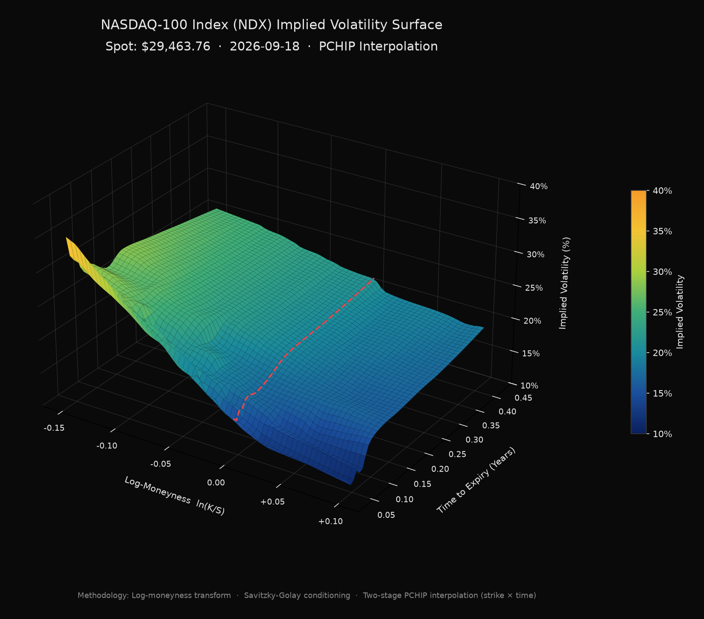

# Options Premium Pricer

**Traders@SMU · HW 1.** Black-Scholes-Merton, American binomial tree, Longstaff-Schwartz Monte Carlo, Greeks, implied volatility and volatility surfaces, as a Python package, a CLI and a website.

**Live site:** https://ferrsir.github.io/options-pricer/



## What's here

| HW requirement | Where |
|---|---|
| BSM pricer (+ dividend yield) | [`src/pricer/bsm.py`](src/pricer/bsm.py) |
| American options pricer (CRR tree, exercise-vs-continue at each node) | [`src/pricer/binomial.py`](src/pricer/binomial.py) |
| LSMC (regression on basis functions, compare to the tree) | [`src/pricer/lsmc.py`](src/pricer/lsmc.py) |
| Greeks + visualizations (stretch) | `bsm_greeks`, [`viz.py`](src/pricer/viz.py), *Greeks* tab on the site |
| Slide sanity checks | [`checks.py`](src/pricer/checks.py), 22 tests in [`tests/`](tests/test_pricer.py) |
| Implied vol from a market premium | `implied_vol`, *Your premium* box on the site |
| Vol-surface picture from Yahoo Finance | `python -m pricer surface NDX` |
| Ticker → Yahoo data | [`data.py`](src/pricer/data.py) + site |
| How every number is derived | **[METHODOLOGY.md](METHODOLOGY.md)** |
| Plain-English explanation of every term, number and graph | **[GUIDE.md](GUIDE.md)** (also the *Guide* tab on the site) |
| Type your own premium and see what happens | *Your premium* box, banner and *What-if* tab on the site |

## Quick start

```bash
git clone https://github.com/Ferrsir/options-pricer && cd options-pricer
python -m venv .venv && .venv\Scripts\activate      # macOS/Linux: source .venv/bin/activate
pip install -e ".[dev]"
python -m pytest -q                                   # 22 tests
```

### Price an option

```bash
# manual inputs: 1y ATM put, 5% rate, 20% vol; American tree + LSMC + charts
python -m pricer price --spot 100 --strike 100 --years 1 --rate 0.05 --vol 0.2 --type put --lsmc --out output/put

# from a ticker (spot, rate, dividend yield, historical vol pulled from Yahoo Finance)
python -m pricer price --ticker AAPL --strike 340 --days 30 --type call

# you saw a premium in the market: solve implied vol and price with it
python -m pricer price --ticker AAPL --strike 340 --days 30 --type call --premium 9.25
python -m pricer iv --premium 9.25 --spot 335 --strike 340 --days 30 --rate 0.04
```

Sample output (`S=K=100, T=1, r=5%, σ=20%` put):

```
BSM (European, closed form)         5.5735
European tree (1000 steps)          5.5715   (error vs BSM -0.00200)
American tree (1000 steps)          6.0896   (early-exercise premium +0.5181)
American LSMC (100000 paths)        6.0608   (± 0.0440 95% CI; biased slightly low)
```

### Volatility surface picture

```bash
python -m pricer surface NDX --out output/ndx_surface.png     # any ticker with listed options
python -m pricer surface --demo                               # synthetic data, works offline
```

### Sanity checks from the slide

```bash
python -m pricer checks
```

### Run the website locally with live data for any ticker

```bash
python -m pricer serve          # http://localhost:8000
```

## The website

`docs/` is a static site (plain JS + Plotly, no build step) served by GitHub Pages. The pricing engine is re-implemented in JavaScript and agrees with Python to ~1e-12.

* Inputs for S, K, expiry, σ, r, q; call/put, long/short, European/American
* Glass-style UI with a start-here guide, one-click examples, info tooltips, keyboard-navigable tabs, and a **Copy link** button that restores your exact inputs from the URL
* Type or drag a **premium**: edge vs the model, implied vol, breakeven, P(profit), max gain/loss; optionally lock σ to that premium's implied vol
* **Premium impact** tab: model-vs-market comparison of σ and every Greek, plus curves showing how each number reacts as the premium changes (e.g. "model says 105, market says 150")
* **What-if** tab: move spot, volatility and days and see your P&L, a Greek waterfall of where it came from, and a P&L heat map
* Overview (BSM / European tree / American tree / LSMC), Greeks (charts vs spot, time, vol and a 3-D Greek surface), payoff diagram, tree convergence and early-exercise boundary, interactive 3-D vol surface, live sanity checks, and the derivation

**Ticker data.** Yahoo Finance sends no CORS headers, so a static page cannot call it directly. The site therefore uses:

1. a pricer API if one is reachable (`python -m pricer serve` → full live data for **any** ticker, option chains included), otherwise
2. bundled real Yahoo snapshots (`docs/data/snapshots.json`: NDX, SPX, SPY, QQQ, AAPL, MSFT, NVDA, TSLA, AMZN, GOOGL, META) refreshed with `python scripts/snapshot.py`.

## Repo layout

```
src/pricer/   bsm.py  binomial.py  lsmc.py  surface.py  data.py  viz.py  checks.py  cli.py  server.py
tests/        22 tests: reference values, parity, Greeks vs finite differences, tree convergence, LSMC, surface recovery
docs/         the website (GitHub Pages)   ·   scripts/snapshot.py, build_guide.py   ·   METHODOLOGY.md, GUIDE.md
```

**For AI agents (Claude Code, Codex) and contributors:** read [AGENTS.md](AGENTS.md) first. It has the rules, commands and a handoff log the agents use to talk to each other.

*Educational project, not investment advice. Market data from Yahoo Finance via `yfinance`, which may be delayed or inaccurate.*
